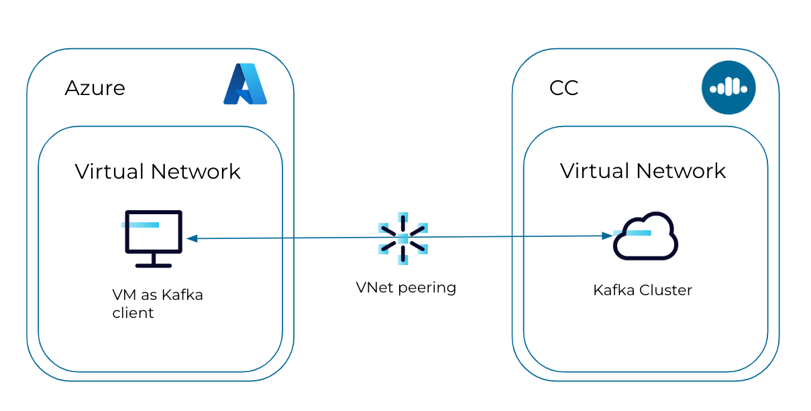

# Azure CC VNet Peering

We want to create an Azure VNet peered to a CC cluster and interact with it.



## Prerequisites

1. [Create a Confluent Cloud Network on Azure](https://docs.confluent.io/cloud/current/networking/ccloud-network/azure.html#create-ccloud-network-azure)
2. [Use the Azure portal to create a virtual network](https://learn.microsoft.com/en-us/azure/virtual-network/quick-create-portal)
3. [Use VNet Peering on Azure](https://docs.confluent.io/cloud/current/networking/peering/azure-peering.html)
4. Create a dedicated CC cluster in the created network

## Test from non-peered network (locally)

We try to create a topic from a local (not-peered) network via
* `kafka-topics` command
```shell
kafka-topics --bootstrap-server <cc-bootstrap-server> --create --topic test --command-config client.properties
```

* Confluent CLI
````shell
confluent kafka topic create test
````

Both are not working and fail with a timeout exception.

## Test from Azure peered VNet

We first create a virtual machine in the above created Azure virtual network (be aware that they both need to be in the same region).
We connect into the VM using SSH (how to is well explained in the Azure portal).

We need to download and install
* Confluent CLI
* Confluent Platform
* Java

We can now create a topic in the CLI and produce/consume messages via

```shell
kafka-console-producer --bootstrap-server <cc-bootstrap-server> --producer.config client.properties --topic test
```

```shell
kafka-console-consumer --bootstrap-server <cc-bootstrap-server> --consumer.config client.properties --topic test --from-beginning
```
